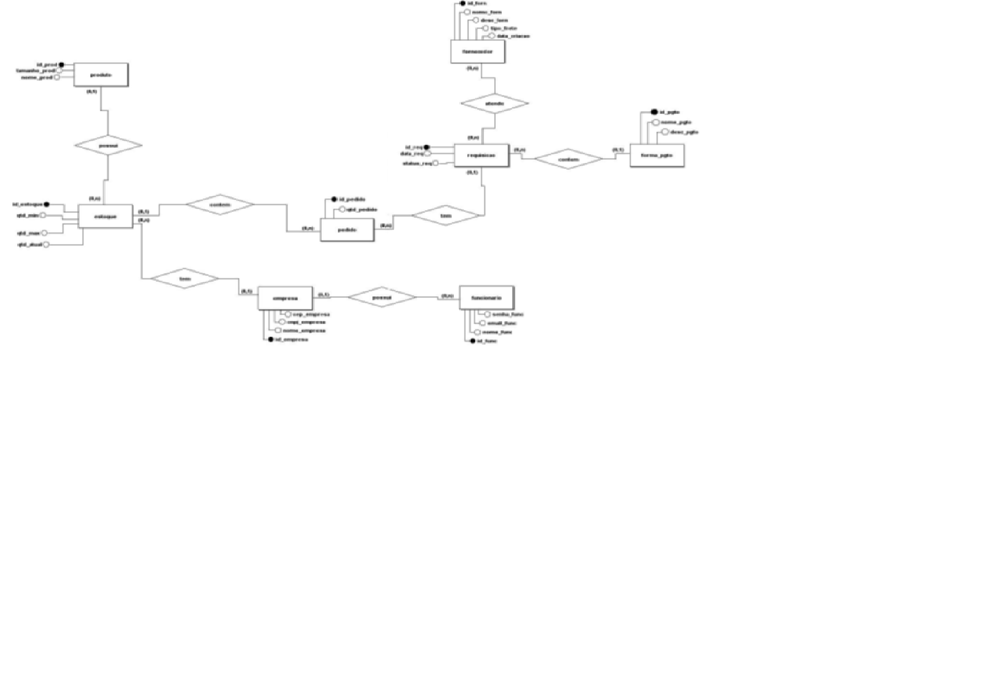
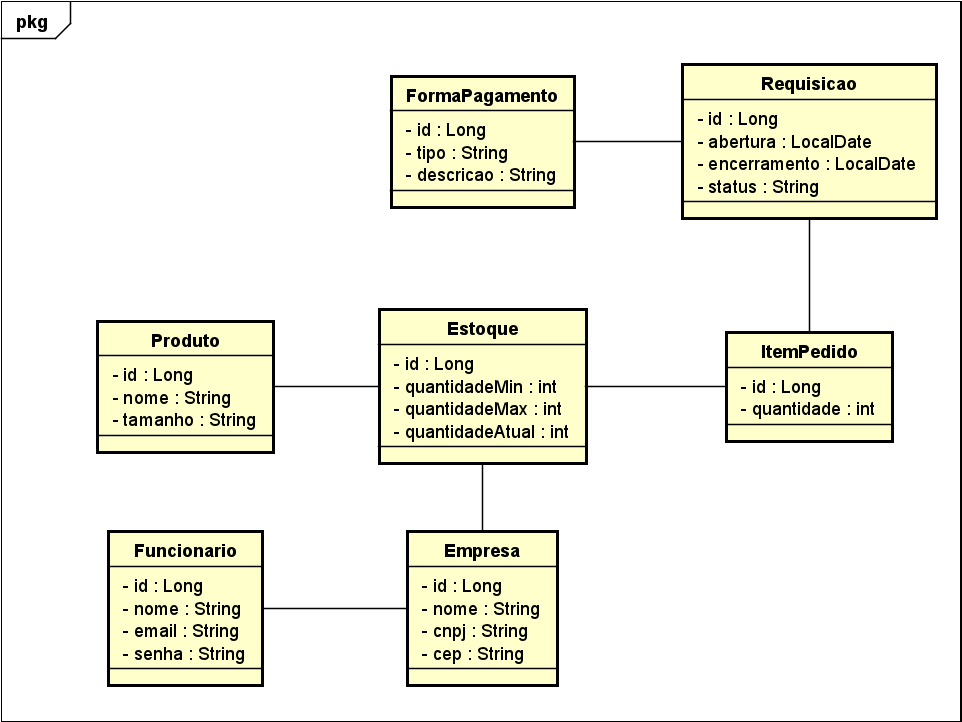

# SmartSuplify

### [Vídeo pitch do projeto](https://www.youtube.com/watch?v=yv77UEPtWuE)
### Protótipo das telas mobile no [figma](https://www.figma.com/file/NzQZk5mPjwQDZ7tL2Ng0yI/Prot%C3%B3tipo-Mobile?type=design&node-id=0-1&mode=design&t=HajvnkP5kFbgQxSe-0)

---

# Equipe:

### Alicia Guiradelo: QA
### Ana Prado: Back-end
### Arthur Foschiani: Front-end
### Bruna Menegatti: Banco de Dados
### Larah Correa: DevOps e AI

# Intruções para rodar o projeto
1. Clonar o projeto
2. Acessar o arquivo persistence.xml e alterar as configurações da **persistence-unit** para que seja possível conectar-se ao banco de dados Oracle da FIAP com o seu usuário e senha.

# DER

# Diagrama de Classes de Domínio

